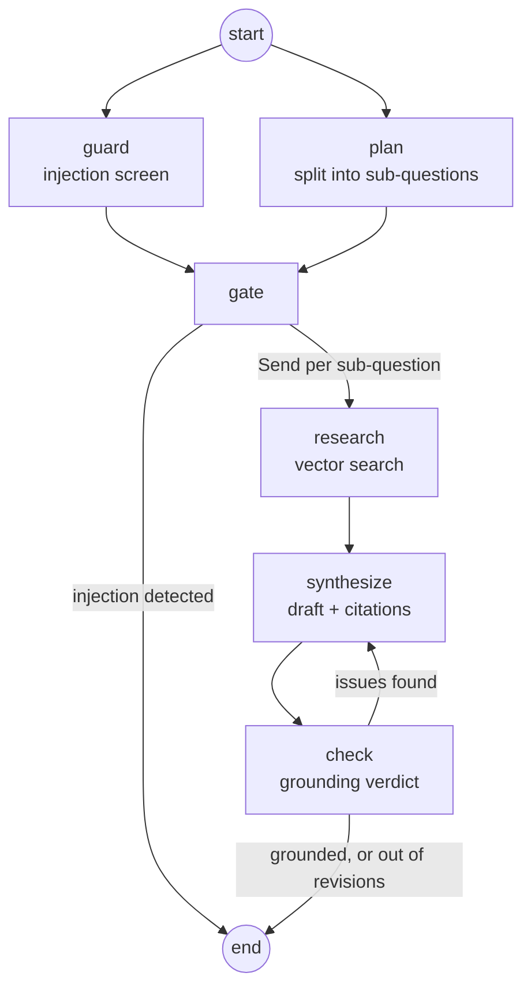

# Policy Agent with Vector DB

A documentation Q&A agent that answers **only** from documents you upload, and refuses when the
documentation does not cover the question.

It is built as a LangGraph state machine rather than a single prompt: the question is screened for
prompt injection, split into sub-questions, researched in parallel against a MongoDB Atlas vector
store, synthesized into one answer, and then verified against the retrieved chunks. If the
verifier finds an unsupported claim, the answer is rewritten — up to a limit, after which the agent
refuses instead of guessing.

## Contents

- [How it works](#how-it-works)
- [Project structure](#project-structure)
- [Prerequisites](#prerequisites)
- [Setup](#setup)
- [Running](#running)
- [API](#api)
- [Tests and evals](#tests-and-evals)
- [Tuning knobs](#tuning-knobs)
- [Current state](#current-state)

## How it works



**guard** — a zero-temperature model decides whether the question tries to override the agent's
instructions or leak its system prompt. Off-topic, rude, or AI-related questions are explicitly
*not* injections. The check fails open: an OpenAI outage must not block real users.

**plan** — rewrites the question into at most 4 sub-questions, each with a search query phrased in
documentation vocabulary rather than the user's wording (vector search matches wording). This node
also resolves references against the conversation history — "and how many projects does *it*
include?" becomes a query about the plan named in the previous turn. If the planner fails, the raw
question is used as a single sub-question.

**gate** — a join node. A conditional branch reads state as of the start of its own superstep, so
the guard verdict is only visible from a node that waits for both `guard` and `plan`.

**research** — fanned out with `Send`, one worker per sub-question, each retrieving `RETRIEVAL_K`
chunks filtered by namespace. Retried up to 3 times. Findings are merged by a concatenating reducer.

**synthesize** — writes one coherent answer over all findings, with a citation per chunk it relied
on. Sub-questions with no supporting chunks must be called out explicitly, not filled in from the
model's general knowledge. History is provided for reference resolution only and is never treated
as a source of facts.

**check** — two layers. First a deterministic one: any citation whose `source#chunkId` was never
retrieved is a fabrication, and no model call is needed to catch it. If the citations are real, a
judge model grades the draft against the chunks. Failures go back to `synthesize` with the issue
list; after `MAX_REVISIONS` the agent returns *"I don't know based on the available
documentation."* Like the guard, verification fails open.

Conversation history lives in MongoDB, keyed by a `threadId` returned with every response. Pass it
back on the next request to continue the thread; omit it to start a new one.

## Project structure

```
backend/
  src/
    agent/
      graph/         state, nodes, routing, compiled graph
      policy.ts      all system prompts (guard, planner, synthesizer, checker)
      memory.ts      conversation threads in MongoDB
      agent.ts       runAgent() — the entry point used by routes and evals
      context.ts     chunk/history formatting for prompts
      tools.ts       kb_search tool (not used by the graph; kept for tool-calling agents)
    kb/
      loaders.ts     PDF / txt / markdown -> Documents
      splitters.ts   recursive character splitting
      ingest.ts      embeds and writes chunks with namespace metadata
      retriever.ts   similarity search with scores
      vectorStore.ts lazily-built Atlas vector store singleton
    routes/          POST /kb/upload, POST /agent/chat
    utils/           env validation, mongo client, OpenAI models
  eval/              vitest tests and evalite evals
client/              Next.js 16 frontend (scaffold — see Current state)
```

## Prerequisites

- Node.js 22+
- An OpenAI API key
- A MongoDB Atlas cluster with **Atlas Vector Search** (the local/community server does not
  support `$vectorSearch`)

## Setup

### 1. Install

```bash
cd backend && npm install
cd ../client && npm install
```

### 2. Environment

Create `backend/.env`. Every variable is required except `PORT`, and the server refuses to start if
any is missing (see `src/utils/env.ts`):

```ini
PORT=5000
OPENAI_API_KEY=sk-...
MONGODB_ATLAS_URI=mongodb+srv://...
MONGODB_DB_NAME=policy_agent
KB_COLLECTION_NAME=kb_chunks
CONVERSATIONS_COLLECTION_NAME=conversations
KB_VECTOR_SEARCH_INDEX=kb_vector_index
```

### 3. Atlas vector search index

Create a vector search index on `KB_COLLECTION_NAME`, named to match `KB_VECTOR_SEARCH_INDEX`. The
field names and dimensions below are what the code expects — `embedding` and `text` are configured
in `src/kb/vectorStore.ts`, and 1536 is the size of `text-embedding-3-small`:

```json
{
  "fields": [
    {
      "type": "vector",
      "path": "embedding",
      "numDimensions": 1536,
      "similarity": "cosine"
    },
    {
      "type": "filter",
      "path": "namespace"
    }
  ]
}
```

The `namespace` filter is what keeps separate document sets from bleeding into each other — the
evals rely on it to seed their own corpora.

## Running

```bash
cd backend && npm run dev      # tsx watch, http://localhost:5000
cd client  && npm run dev      # next dev, http://localhost:3000
```

Other scripts: `npm run lint`, `npm run lint:fix` (both packages).

## API

### `POST /kb/upload`

`multipart/form-data` with a `file` field. Accepts PDF, `.txt`, and `.md`/`.markdown`. The file is
loaded, split into ~800-character chunks with 150 characters of overlap, embedded, and written to
the `default` namespace.

```bash
curl -F "file=@pricing.pdf" http://localhost:5000/kb/upload
```

```json
{ "ok": true, "namespace": "default", "totalChunks": 12, "sources": ["pricing.pdf"] }
```

### `POST /agent/chat`

```json
{
  "message": "How much does the Pro plan cost?",
  "namespace": "default",
  "threadId": "optional-thread-id"
}
```

`namespace` defaults to `"default"`. Omitting `threadId` starts a new conversation; the id in the
response should be sent back on subsequent turns.

```json
{
  "ok": true,
  "threadId": "V1StGXR8_Z5j",
  "answer": "Pro costs 29 USD per user per month.",
  "citations": [{ "source": "pricing.md", "chunkId": 3, "preview": "Pro: 29 USD per user..." }],
  "plan": [{ "id": "sq-0", "question": "...", "query": "..." }]
}
```

A question the guard flags returns `400` with `"Your question does not comply with our policy
rules"`. A missing or blank `message` also returns `400`.

## Tests and evals

Both hit the real OpenAI API and the real Atlas cluster — they cost money and take time. They seed
their own namespaces (`__eval__`, `__eval_memory__`) and poll until Atlas has indexed the new
vectors, since indexing is asynchronous and a freshly written corpus is invisible for a few seconds.

```bash
cd backend
npm test           # vitest: end-to-end assertions on the graph
npm run eval       # evalite watch mode with a browser UI
npm run eval:run   # evalite, single run
```

`agent.eval.ts` scores pricing, refund, out-of-scope, and injection cases on two scorers: *Real
sources* (every cited source exists in the corpus) and *Correctness* (a GPT-4o judge — deliberately
not the gpt-4o-mini that writes and grades inside the graph, because a judge sharing the
generator's blind spots rubber-stamps its own hallucinations).

`memory.eval.ts` covers conversation memory: pronoun and elliptical follow-ups, a subject two turns
back, a topic switch that must not drag the answer back to pricing, and two cases where a "fact"
planted by the user in the history must lose to the documentation. It adds a third scorer,
*Resolved subject*, because correctness alone cannot fail a memory eval — an agent that lists every
plan at once technically "conveys the reference answer".

## Tuning knobs

| Value | Where | Default |
| --- | --- | --- |
| `MAX_SUB_QUESTIONS` | `src/agent/graph/state.ts` | 4 |
| `RETRIEVAL_K` | `src/agent/graph/state.ts` | 2 chunks per sub-question |
| `MAX_REVISIONS` | `src/agent/graph/state.ts` | 3 |
| chunk size / overlap | `src/kb/splitters.ts` | 800 / 150 |
| history window | `src/agent/context.ts` | last 10 messages |
| chat / judge model | `src/utils/openai.ts` | `gpt-4o-mini` |
| embedding model | `src/utils/openai.ts` | `text-embedding-3-small` |

Prompts live in one place, `src/agent/policy.ts` — that is the file to edit to change the agent's
behavior.

## Current state

The backend is complete and covered by tests and evals. The `client/` package is still the
`create-next-app` scaffold (Next.js 16, React 19, Tailwind v4, shadcn/ui configured) — the chat UI
is not implemented yet, so the API is exercised via HTTP directly.

Upload is hardcoded to the `default` namespace in `routes/kb.ts`, even though the retrieval layer
is namespace-aware throughout; exposing it as a request field is the natural next step for
multi-tenant use.
