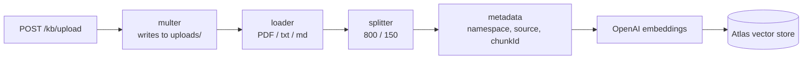
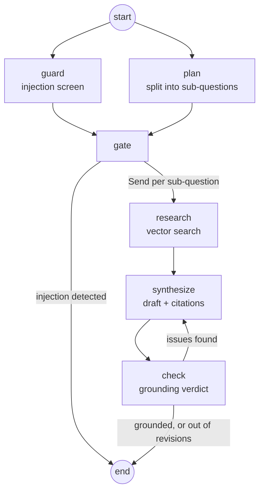

# Architecture

The system has two independent paths: an ingestion pipeline that writes chunks into a vector store,
and an agent graph that reads from it. They share only the vector store and the embedding model.

## Components

| Component | Location | Responsibility |
| --- | --- | --- |
| HTTP server | `backend/src/index.ts` | Express app, JSON body parsing capped at 10 MB, open CORS, mounts the two routers |
| Knowledge base router | `backend/src/routes/kb.ts` | `POST /kb/upload`, multipart handling via multer |
| Agent router | `backend/src/routes/agent.ts` | `POST /agent/chat`, thread resolution and history persistence |
| Loaders | `backend/src/kb/loaders.ts` | PDF, plain text, and Markdown to documents; stamps the original file name as `source` |
| Splitter | `backend/src/kb/splitters.ts` | Recursive character splitting, 800 characters with 150 of overlap |
| Ingest | `backend/src/kb/ingest.ts` | Assigns `namespace`, `source`, and `chunkId` metadata, then embeds and writes |
| Vector store | `backend/src/kb/vectorStore.ts` | Lazily built Atlas vector search singleton |
| Retriever | `backend/src/kb/retriever.ts` | Similarity search with scores, namespace-filtered |
| Agent graph | `backend/src/agent/graph/` | State definition, nodes, routing, compiled graph |
| Prompts | `backend/src/agent/policy.ts` | Every system prompt in the system, in one file |
| Memory | `backend/src/agent/memory.ts` | Conversation threads in MongoDB, keyed by `threadId` |
| Models | `backend/src/utils/openai.ts` | `gpt-4o-mini` for chat and judging, `text-embedding-3-small` for embeddings |

## Ingestion flow

Each stage can produce an empty result, and each empty result is a `400` rather than a silent
success: an unsupported file yields no documents, and a document of only whitespace yields no
chunks. `chunkId` is assigned per ingestion run, starting at zero, so it identifies a chunk only in
combination with its `source`.

## Agent flow

**guard** — a zero-temperature model decides whether the question tries to override the agent's
instructions or leak its system prompt. Off-topic, rude, and merely AI-related questions are
explicitly not injections.

**plan** — rewrites the question into at most four sub-questions, each carrying a search query
phrased in documentation vocabulary rather than the user's wording. This node also resolves
references against the conversation history.

**gate** — a join node. A conditional branch reads state as of the start of its own superstep, so
the guard verdict is only visible from a node that waits for both `guard` and `plan`.

**research** — fanned out with `Send`, one worker per sub-question, each retrieving `RETRIEVAL_K`
chunks filtered by namespace, retried up to three times. Findings are merged by a concatenating
reducer.

**synthesize** — writes one coherent answer across all findings. Sub-questions with no supporting
chunks must be called out explicitly rather than filled in from the model's general knowledge.

**check** — two layers. A deterministic pass rejects any citation whose `source#chunkId` pair was
never retrieved. If the citations are real, a judge model grades the draft against the chunks.
Failures return to `synthesize` with the issue list.

## Design decisions

### A graph, not a single prompt

Each failure mode has its own node with its own prompt and its own test. A regression in planning is
visible as a bad plan rather than as a vaguely worse answer, and the plan is returned in the API
response so a caller can see how a question was interpreted.

**Trade-off:** a single question costs at least four model calls, and more when a draft is rejected.
Latency and cost are several times that of a one-shot prompt.

### Guard and planner run in parallel

Both depend only on the question, so the graph starts them together and joins at `gate`. Planning a
question that is then blocked wastes one call; serializing would add its latency to every request.

**Trade-off:** wasted planner calls on blocked questions, in exchange for lower latency on the
common path.

### Guard and checker fail open

If the OpenAI call behind the injection screen or the grounding check throws, the request proceeds.
An outage in a safety check should not take the product down for legitimate users.

**Trade-off:** during an outage, unscreened questions reach the agent and unverified drafts reach
the user. This is the right default for a documentation assistant reading a public knowledge base;
a system where the guard is a security control rather than a quality control would need to fail
closed.

### Deterministic citation checking before the judge

Comparing cited `source#chunkId` pairs against what was actually retrieved catches fabricated
citations exactly, with no model call and no false negatives. The judge model runs only when the
citations are real, so it grades claims rather than references.

**Trade-off:** none of consequence. The check cannot detect a real citation that fails to support
the claim, which is precisely what the judge is for.

### Separate judge and generator configuration

Drafting runs at temperature 0.2; the guard and the checker run at temperature 0 for stable
verdicts. The evaluation suite goes further and judges with GPT-4o rather than the `gpt-4o-mini`
that writes and grades inside the graph, because a judge that shares the generator's blind spots
rubber-stamps its own hallucinations.

**Trade-off:** the in-graph checker does share the generator's model. It catches contradictions and
unsupported specifics, not blind spots common to both.

### Bounded revision, then refusal

After `MAX_REVISIONS` rejected drafts, the agent returns "I don't know based on the available
documentation." rather than the best rejected attempt.

**Trade-off:** a user occasionally receives a refusal where a partially correct answer existed. For
pricing and policy questions, that is the cheaper error.

### Namespaces as the isolation boundary

Every chunk carries a `namespace`, retrieval filters on it, and the Atlas index declares it as a
filter field. This is what lets evaluation suites seed their own corpora without polluting real
data.

**Trade-off:** the upload endpoint hardcodes `default` and does not expose the namespace as a
request field, so the isolation the retrieval layer supports is not reachable through the API.
Exposing it is the natural next step for multi-tenant use.

### Conversation history is context, not truth

History is passed to the planner to resolve references and to the synthesizer to interpret the
question, with explicit instructions that it is never a source of facts. A "fact" a user plants in
an earlier turn loses to the retrieved documentation. The window is the last ten messages.

**Trade-off:** conversations longer than ten messages silently lose their earliest turns, so a
reference reaching further back fails to resolve.

### Lazily built singletons

The Mongo collection, the vector store, and the conversation collection are each built once behind a
cached promise, and the conversation index is created on first use. The server starts without
touching the database.

**Trade-off:** a misconfigured connection string surfaces on the first request rather than at
startup. Environment variables are validated eagerly at import time, which covers the common case.

## Data model

Knowledge base chunks carry `namespace`, `source`, `chunkId`, the chunk text under `text`, and a
1536-dimension `embedding`. Conversations are documents of `threadId`, an array of
`{ role, content, ts }` messages, `createdAt`, and `updatedAt`, with a unique index on `threadId`.

## Tuning

| Value | Location | Default |
| --- | --- | --- |
| `MAX_SUB_QUESTIONS` | `backend/src/agent/graph/state.ts` | 4 |
| `RETRIEVAL_K` | `backend/src/agent/graph/state.ts` | 2 chunks per sub-question |
| `MAX_REVISIONS` | `backend/src/agent/graph/state.ts` | 3 |
| Chunk size and overlap | `backend/src/kb/splitters.ts` | 800 / 150 |
| History window | `backend/src/agent/context.ts` | Last 10 messages |
| Citation preview length | `backend/src/agent/context.ts` | 400 characters |
| Chat and judge model | `backend/src/utils/openai.ts` | `gpt-4o-mini` |
| Embedding model | `backend/src/utils/openai.ts` | `text-embedding-3-small` |

## Frontend

`client/` is a Next.js scaffold with Tailwind and shadcn/ui configured. It makes no requests to the
API yet, so the service is exercised over HTTP directly.
